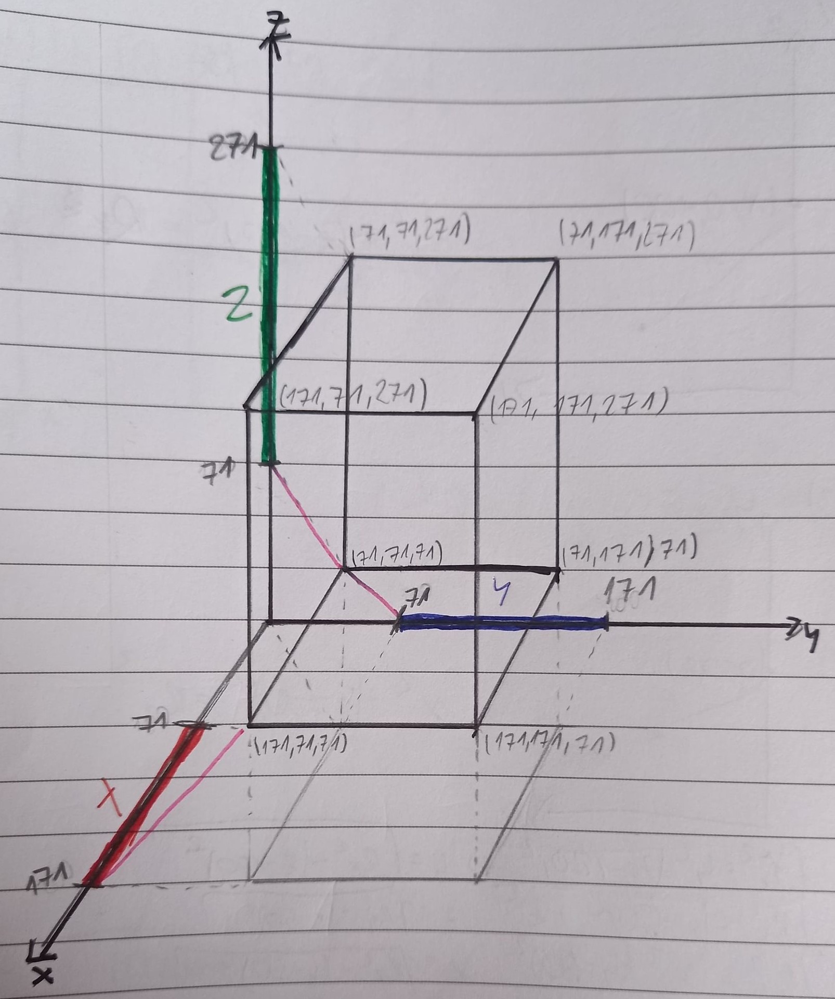
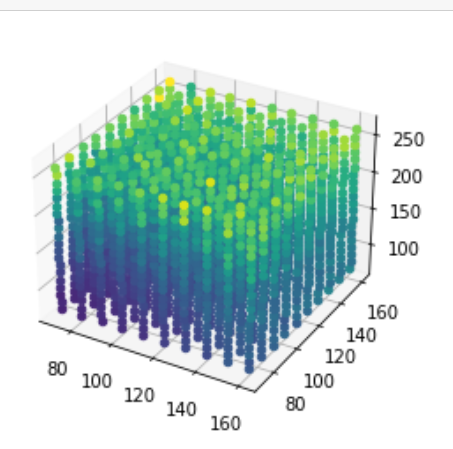

###########################
Magnetic Field Localization
###########################

*****************
About project
*****************

This program is a part of a Master’s Thesis concerning Magnetic Field Localization in the Human body.

*****************
Test scenario
*****************

To test the possibility of using a magnetic field to locate sensors, a special scenario was created. Visualization is in the picture below.

Let’s assume a 3d Cartesian coordinate system. In the model, three rectilinear cords generate a magnetic field: green on the Z axis, blue on the Y axis, and red on the X axis. Sensors are evenly spaced in a cuboidal space simulating the human body. 

Each sensor measures the magnetic flux for each magnet (with added noise). 

In the test scenario, all measurements are calculated simultaneously. However, it is assumed that magnets are powered sequentially. 

*****************************
Permeability of human tissues
*****************************

.. note:: 
    This chapter is based on: 

    G\. Shimonov, A. Koren, G. Sivek and E. Socher, "Electromagnetic Property Characterization of Biological Tissues at D-Band," in IEEE Transactions on Terahertz Science and Technology, vol. 8, no. 2, pp. 155-160, March 2018, doi: 10.1109/TTHZ.2018.2789357.

.. image:: ../Images/perm_mean.PNG

.. image:: ../Images/perm_tissue.PNG

*****************
Parameters
*****************

In this section, there are parameters used in the test simulation.

1) Current [I] = 135 kA
2) Magnetic flux [M] = 27 T (1 mm from magnet)
3) Magnetometer sensitivity = 0,22 V/T

.. note:: 
    For this version, sensor parameters are based on:

    M\. Banjevic, B. Furrer and R. S. Popovic, "2D CMOS integrated magnetometer based on the miniaturized circular vertical Hall device," TRANSDUCERS 2009 - 2009 International Solid-State Sensors, Actuators and Microsystems Conference, 2009, pp. 877-880, DOI: 10.1109/SENSOR.2009.5285857.

    In the future, there is a plan to use more accurate sensors for simulations.

Teslameter parameters
#####################

1) Current [I] = 20 kA
2) Magnetic flux [M] = 4 T (1 mm from magnet)
3) Teslameter sensitivity = 0,4 V/T
4) Teslameter resolutiom = 0,1 ppm
5) Teslameter accuracy = 50 ppm

.. note:: 
    This Teslameter's parameters are based on:

    Dragana Popovic Renella, Sasa Dimitrijevic, Sasa Spasic, Radivoje S. Popovic,"High-accuracy teslameter with thin high-resolution three-axis Hall probe", Measurement,Volume 98, 2017, Pages 407-413, ISSN 0263-2241, https://doi.org/10.1016/j.measurement.2015.06.023.

.. note:: 
    For safety, magnetic flux density was based on MRI parameters:

    John F. Schenck, "Physical interactions of static magnetic fields with living tissues", Progress in Biophysics and Molecular Biology, Volume 87, Issues 2–3, 2005, Pages 185-204, ISSN 0079-6107, https://doi.org/10.1016/j.pbiomolbio.2004.08.009.

    .. image:: ../Images/mri_field.png

    Fig\: "Field, gradient and force product along the axis of a large 4 T, whole-body  uperconducting magnet. The center of the magnet is at z = 0 and the bore ends at z = 1\:02 m\: The maximum gradient is 2.78 T/m at z = 1\:47 m\: The maximum value of B(dB/dz) is 8.79 T^2/m at z = 1\:14 m (Reprinted, with permission, from Schenck et al., 1992)."

*****************
Results
*****************

For each sensor, ten measurements were carried out and the mean position errors were calculated. 

The directional error is a difference between calculated and measured flux for each magnet. A total position error is a length of a vector composed of directional errors.

Sensor positions are depicted below. Their colours reflect total position errors. The brighter the colour is, the bigger the error. Maximal calculated error equals 9,7 cm. 

Teslameter results
##################

For teslameter Maximal calculated error equals 1,33 cm.

Magnetic flux density ~ 1-4 mT.

.. image:: ../Images/results_teslameter.png